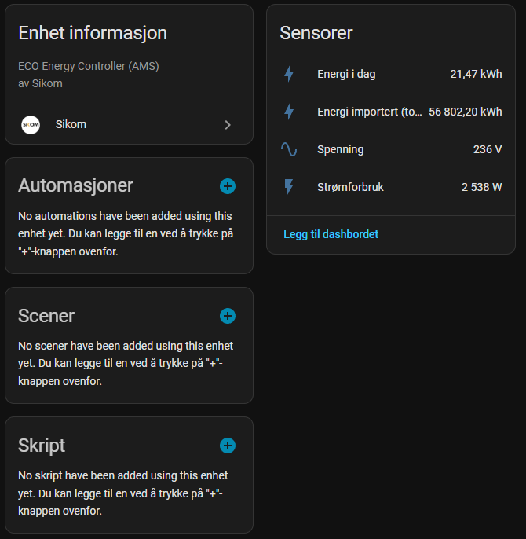
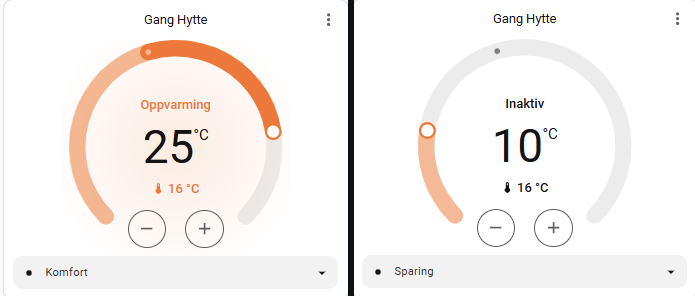

---

# Sikom for Home Assistant

[Norsk](README.md) · **English**

A modern, robust, and user-friendly integration to connect Sikom devices (thermostats, relays, and AMS meters) to Home Assistant.

This integration is a custom component that uses Sikom's official Connome API. It replaces the need for manual configuration with `rest_sensor`, `rest_command`, and other YAML-based solutions. Everything is now handled through a simple user interface.

## Features

-   **Automatic Device Detection:** Automatically discovers all thermostats, relays, and AMS meters on your Sikom account.
-   **Intelligent Sensor Creation:** Only creates sensors for the data a device actually reports, avoiding "unavailable" entities.
-   **Climate Control:** Creates native `climate` entities for your thermostats with full functionality.
-   **Switches:** Creates `switch` entities for devices like water heaters and relays.
-   **Energy Monitoring:** Creates sensors for AMS meters that are fully compatible with Home Assistant's Energy dashboard.
-   **Support for Easee EV Charger:** Also integrates Easee chargers connected via Sikom, providing both on/off control (`switch`) and sensors for power consumption and voltage.
-   **Connectivity Status:** Creates a `binary_sensor` for devices that report their online status – perfect for power outage notifications at your cabin.
-   **Simple Configuration:** No YAML editing required.

## Requirements

-   Home Assistant 2024.x or newer.
-   A valid Sikom account with connected devices.
-   [HACS (Home Assistant Community Store)](https://hacs.xyz/) installed.

## Installation

The easiest way to install is via HACS.

1.  Go to **HACS > Integrations** in Home Assistant.
2.  Search for **"Sikom"** and install it.
3.  Restart Home Assistant when prompted.

*(If the integration is not yet in the default HACS store, you can add it as a "Custom repository" as described in the HACS documentation).*

## Configuration

1.  Go to **Settings > Devices & Services**.
2.  Click **Add Integration** in the bottom right corner.
3.  Search for **"Sikom"** and select it.
4.  Enter the username (email) and password for your Sikom account.
5.  You will be presented with a list of all discovered devices. Check the boxes for the ones you want to add to Home Assistant.
6.  Click "Submit", and your devices will be added!

### Modifying devices later
To add or remove devices, go to **Settings > Devices & Services**, find the Sikom integration, and click **"Configure"**.

## Tips & Tricks

### Temperature display on the thermostat card
Home Assistant's built-in thermostat card may sometimes hide the measured room temperature on the dashboard when the thermostat is idle. This is normal. You can **always see the exact temperature** by **clicking the card** to open the details view.

For full control over the appearance, you can use alternative cards from HACS, like the [Simple Thermostat Card](https://github.com/nervetattoo/simple-thermostat).

## Contributions
This integration has been tested with the devices available to the author. Because it's built to be flexible, it may work fully or partially with other Sikom devices as well.

If you have a Sikom device that is not fully supported, please open an 'issue' on GitHub and feel free to share API data (without personal information), so we can look into adding better support.

## Disclaimer
This is an unofficial, community-driven project and is not affiliated with or supported by Sikom AS. Use at your own risk. The integration depends on Sikom's current Connome API. Future changes by Sikom may affect functionality.

## Acknowledgements
This project is written and maintained by [@Howard0000](https://github.com/Howard0000). An AI assistant provided help with troubleshooting, code improvements, and documentation.

## License
This project is licensed under the [MIT License](LICENSE).
